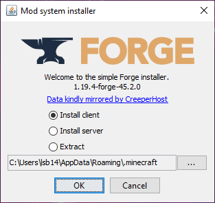

```{r setup, include=FALSE}
knitr::opts_chunk$set(echo = FALSE)
```

```{r}
library(htmltools)

```

```{css}
body {
  font-family: Helvetica, Arial, sans-serif;
  background-color: #3e3e3e;
  font-size: 15px;
}

#header {
  background-color: #013220;
  color: white;
  padding: 25px;
  text-align: center;
}

#forgeinstall, #modinstall, #serversetup, #faq, #gettingstarted, #connecting {
  padding: 40px;
  background-color: #f4f4f4;
}

#section2 {
  background-color: #E9ECEF;
}

#myBtn {
  display: none; /* Hidden by default */
  position: fixed; /* Fixed/sticky position */
  bottom: 20px; /* Place the button at the bottom of the page */
  right: 30px; /* Place the button 30px from the right */
  z-index: 99; /* Make sure it does not overlap */
  border: none; /* Remove borders */
  outline: none; /* Remove outline */
  background-color: #013220; /* Set a background color */
  color: white; /* Text color */
  cursor: pointer; /* Add a mouse pointer on hover */
  padding: 15px; /* Some padding */
  border-radius: 10px; /* Rounded corners */
  font-size: 18px; /* Increase font size */
}

.section-title {
  font-size: 24px;
  margin-bottom: 10px;
}

/* Style the tab */
.tab {
  overflow: hidden;
  border: 1px solid #ccc;
  background-color: #f1f1f1;
}

/* Style the buttons that are used to open the tab content */
.tab button {
  background-color: inherit;
  float: left;
  border: none;
  outline: none;
  cursor: pointer;
  padding: 14px 16px;
  transition: 0.3s;
}

/* Change background color of buttons on hover */
.tab button:hover {
  background-color: #ddd;
}

/* Create an active/current tablink class */
.tab button.active {
  background-color: #ccc;
}

/* Style the tab content */
.tabcontent {
  display: none;
  padding: 6px 12px;
  border: 1px solid #ccc;
  border-top: none;
  animation: fadeEffect 1s; /* Fading effect takes 1 second */
}

/* Go from zero to full opacity */
@keyframes fadeEffect {
  from {opacity: 0;}
  to {opacity: 1;}
}

ul {
  list-style-type: none; /* Remove default bullet points */
}

ul li {
  list-style-type: none; /* Remove default bullet points */
}
```
<!-- Tab links -->
<div class="tab">
  <button class="tablinks" onclick="openCity(event, 'gettingstarted')"> Getting Started</button>
  <button class="tablinks" onclick="openCity(event, 'forgeinstall')">Installing Forge</button>
  <button class="tablinks" onclick="openCity(event, 'modinstall')">Installing Mods</button>
  <button class="tablinks" onclick="openCity(event, 'serversetup')">Setting up the Server</button>
  <button class="tablinks" onclick="openCity(event, 'connecting')">Connecting</button>
  <button class="tablinks" onclick="openCity(event, 'faq')">FAQ and Troubleshooting</button>
</div>

<div id="back">
  <button onclick="topFunction()" id="myBtn" title="Go to top">Back to Top</button>
</div>

<script>
  // Get the button:
let mybutton = document.getElementById("myBtn");

// When the user scrolls down 20px from the top of the document, show the button
window.onscroll = function() {scrollFunction()};

function scrollFunction() {
  if (document.body.scrollTop > 20 || document.documentElement.scrollTop > 20) {
    mybutton.style.display = "block";
  } else {
    mybutton.style.display = "none";
  }
}

// When the user clicks on the button, scroll to the top of the document
function topFunction() {
  document.body.scrollTop = 0; // For Safari
  document.documentElement.scrollTop = 0; // For Chrome, Firefox, IE and Opera
}
</script>

<!-- Tab content -->
<script>
  function openCity(evt, cityName) {
  // Declare all variables
  var i, tabcontent, tablinks;

  // Get all elements with class="tabcontent" and hide them
  tabcontent = document.getElementsByClassName("tabcontent");
  for (i = 0; i < tabcontent.length; i++) {
    tabcontent[i].style.display = "none";
  }

  // Get all elements with class="tablinks" and remove the class "active"
  tablinks = document.getElementsByClassName("tablinks");
  for (i = 0; i < tablinks.length; i++) {
    tablinks[i].className = tablinks[i].className.replace(" active", "");
  }

  // Show the current tab, and add an "active" class to the button that opened the tab
  document.getElementById(cityName).style.display = "block";
  evt.currentTarget.className += " active";
}
</script>

<div id="gettingstarted" class = "tabcontent" style="display:block"> 
  <h2 class="section-title"><u>Getting Started</u></h2>
<div><strong>What is This Guide</strong></div>
<ul>
  <div>In this guide, we'll go through the process of getting started with a modded Minecraft Server on a Windows machine. In our example, we'll be using Minecraft 1.19.4, but the process should be the same for any version of Minecraft Java. You'll have to have installed Minecraft and launched it at least once on your preferred version before starting this guide, visit out Q&A section for more on how to do that. </div>
</ul>
  
  <div><strong>Important Terms</strong></div>
<ul>
<div><strong>Mod: </strong>Mod is simply short for modification, and it refers to files that can be used to modify Minecraft's features or even add new ones entirely.</div>
<div><strong>Server: </strong>A server is a Minecraft world that runs independently of the game itself. Meaning that it can stay on whether or not it's host is playing the game. This makes it great for playing with friends since they can continue even if you cannot be online yourself.</div>
<div><strong>Forge: </strong> Forge, also called Minecraft Forge, is a program that allows Minecraft to actually run mods, and without it the game would not even recognize the files.</div>
</ul>
<div><strong>Finding Mods Safely</strong></div>
<ul>
<div>It's also important to understand that Minecraft mods are community made. This mean that, while most sites will verify the files they provide, downloading a mod is ultimately no different than downloading any other random file from a stranger. We'll provide some well known sources when it comes time to pick mods, and we recommend using those for your modding needs.</div>
</ul>
<div><strong>Security Popups</strong></div>
<ul>
<div>Throughout the process of installing mods and setting up a server, you may receive pop-ups from Windows that request permission to make changes on your computer. These pop-ups are an important security feature, and they help keep malicious programs from running on your computer. In order to follow this guide you will likely need to grant programs like the Forge installer or server’s “run.bat” permission to make changes. While we can say that we have no intention of harming your computer, we can not guarantee the safety of the process.
</div>
</ul>
<div><strong>If you understand the above, then you're ready to move on to installing Minecraft Forge!</strong></div>
</div>

 <div id="forgeinstall" class = "tabcontent"> 
 <h2 class="section-title"><u>Installing Forge</u></h2>
  <ul>
    <li>
      <p><strong>Step 1:</strong> Navigate to the download page for
        [Minecraft Forge](https://files.minecraftforge.net/net/minecraftforge/forge/index_1.20.2.html) </p>
      
    </li>
    <li>
      <p><strong>Step 2:</strong> Use the menu on the left side of the page to 
      select your preferred version of Minecraft.</p>
    </li>
    <li>
      <p><strong>Step 3:</strong> Click the button labeled “Installer.”</p>
      <p><strong> Note:</strong> If there are two download options, select the one labeled “Download Recommended.”</p>
    </li>
    <li>
      <p><strong>Step 4:</strong> Use the menu on the left side of the page to 
      select your preferred version of Minecraft.</p>
    </li>
    <li>
      <p><strong>Step 5:</strong> On your keyboard, press the Windows key and the <strong>R</strong> key 
      at the same time.</p>
    </li>
      </li>
      <li>
      <p><strong>Step 6:</strong> Enter “Downloads” into the search box.</p>
    </li>
    <li>
      <p><strong>Step 7:</strong> In the new window, double click on the file you 
      just downloaded, which should have a name ending in “installer.jar” and be
      near the top of the download list.</p>
    </li>
    <li>
      <p><strong>Step 8:</strong> "Install Client" should already be selected, so simply
      click the "OK" button. </p>

    </li>
    <li>
      <p><strong>Step 9:</strong> Once the window stating that the installation was successful, click the "OK" button.</p>
    </li>
    <li>
      <p><strong>Step 10:</strong> Navigate to the Minecraft launcher, but do not launch the game yet.</p>
    </li>
    <li>
      <p><strong>Step 11:</strong> Click the "Installations" button near the top of the launcher. </p>
    </li>
     <li>
      <p><strong>Step 12:</strong> Click "New installation" just below the search bar. </p>
      
    </li>
     <li>
      <p><strong>Step 13:</strong> Name the installation whatever you'd like. </p>
    </li>
    <li>
      <p><strong>Step 14:</strong> Select your newly installed Forge version in the "Version"
      dropdown menu.</p>
      <ul><p><strong> Note:</strong> It should be named something similar to “release 1.19.4-forge-45.2.0” except it will use the version numbers for your installation.</p></ul>
    </li>
    <li>
      <p><strong>Step 15:</strong> Click "Create" in the bottom right of the launcher. </p>
    </li>
    <li>
      <p><strong>Step 16:</strong> Return to the main page by clicking "Play" near the top of the launcher </p>
    </li>
    <li>
      <p><strong>Step 17:</strong> Select your newly created installation in the drop-down menu to the left of the large green "Play Button". </p>
    </li>
    <li>
      <p><strong>Step 18:</strong> A warning about modding should appear, you may read it if you'd like. </p>
    </li>
    <li>
      <p><strong>Step 19:</strong> Continue by clicking the green "Play" button </p>
    </li>
  </ul>
</div>


<div id="modinstall" class = "tabcontent">
  <h2 class="section-title"><u>Installing Mods</u></h2>
  <p>Selecting mods to install can be more of an art than a science, since mods are community made and may not always work with all other mods. Mods can be found from various sources, such as [MinecraftMods.com](https://www.minecraftmods.com/) and [CurseForge.com](https://www.curseforge.com/MINECRAFT). When selecting mods, it’s important to ensure they are for your version of Minecraft Forge, as otherwise they can cause major issues. Luckily, the mod installation steps are now quite simple. </p>
  <br>
  <ul>
    <li>
      <p><strong>Step 1:</strong> Navigate to your desktop.</p>
    </li>
    <li>
      <p><strong>Step 2:</strong> On your keyboard, press the <strong>Windows</strong> key and the <strong>R</strong> key at the same time.</p>
    </li>
    <li>
      <p><strong>Step 3:</strong> Enter "*%appdata%*" into the search box</p>
    </li>
    <li>
      <p><strong>Step 4:</strong> Open the "*.minecraft*" folder</p>
    </li>
    <li>
      <p><strong>Step 5:</strong> Open the "mods" folder</p>
      
    </li>
    <li>
      <p><strong>Step 6:</strong> You can now copy and paste the mods you'd like to use into this folder.</p>
    </li>
    <li>
      <p><strong>Step 7:</strong> Launch the game to make sure everything is working properly.</p>
    </li>
    <li>
      <p><strong>Step 8:</strong> Close the game to move on to the next section.</p>
    </li>
  </ul>
</div>

<div id="serversetup" class = "tabcontent">
  <h2 class="section-title"><u>Setting Up a Server</u></h2>
   <ul>
    <li>
      <p><strong>Step 1:</strong> Navigate to your desktop.</p>
    </li>
     <li>
      <p><strong>Step 2:</strong> On your keyboard, press <strong>ctrl</strong>, <strong>shift</strong>, and <strong>n</strong> at the same time to create a new folder.</p>
    </li>
    <li>
      <p><strong>Step 3:</strong> Name the folder whatever you'd like.</p>
      <ul><p><strong> Note:</strong> This is your server folder, you’ll be returning to it throughout the guide.</p></ul>
    </li>
    <li>
      <p><strong>Step 4:</strong> Navigate to the Minecraft Forge installer for your chosen Minecraft version (alternatively follow steps 1-7 of the Installing Forge section.) </p>
    </li>
    <li>
      <p><strong>Step 5:</strong> Select "Install Server" in the installer. </p>
    </li>
    <li>
     <p><strong>Step 6:</strong> Click the button labeled with three dots to the right of the file path. </p>
    </li>
    <li>
     <p><strong>Step 7:</strong> Click the "Desktop" button on the left side of the window.</p>
     
    </li>
    <li>
     <p><strong>Step 8:</strong> In the window, open the folder that you'd like to contain your server.</p>
    </li>
    <li>
     <p><strong>Step 9:</strong> Click the "Open" near the bottom right of the window.</p>
    </li>
    <li>
     <p><strong>Step 10:</strong> Click the "OK" button once it appears.</p>
    </li>
    <li>
      <p><strong>Step 11:</strong> Navigate to your server folder. </p>
    </li>
    <li>
     <p><strong>Step 12:</strong> Open the file "run.bat" and wait for the text to stop scrolling.</p>

    </li>
    <li>
      <p><strong>Step 13:</strong> Press <strong>enter</strong> on the keyboard to close the terminal window </p>
    </li>
    <li>
      <p><strong>Step 14:</strong> In the server folder, open "eula.txt" using notepad or another text editor.</p>
      <ul><p><strong>Note:</strong> The file contains a link to the End User License Agreement (EULA), which is the set of terms you agree to abide by while playing the game. You may follow the link if you'd like to read it in detail.</p></ul>
    </li>
     <li>
     <p><strong>Step 15:</strong> Replace "eula=false" with *"eula=true"*.</p>
      
    </li>
    <li>
      <p><strong>Step 16:</strong> On the keyboard, press <strong>ctrl</strong> and <strong>s</strong> at the same time to save the file. </p>
    </li>
    <li>
      <p><strong>Step 17:</strong> Close the window. </p>
    </li>
    <li>
     <p><strong>Step 18:</strong> Place your chosen mods into the "mods" folder.</p>
     <ul><p><strong>Note:</strong> Assuming that you've already installed them for single player, simply copy and paste your single player mods into your server's folder.</p></ul>
      
    </li>
    <li>
      <p><strong>Step 19:</strong>Open "run.bat" and wait for the server to start.</p>
      <ul><p><strong>Note</strong> Opening this file should create two new windows. The black window is your server terminal and we will be returning to it. The white window is the server status panel and we won’t need it here. Once the text in the server terminal stops appearing the server should be started. To double check, you can try typing in the terminal, if it allows you to then the server is started.</p></ul>
      <li><p><strong>Step 20:</strong> Type "stop" into the terminal.</p></li>
      <li><p><strong>Step 21:</strong> Press the <strong>enter</strong> key to close the server.</p></li>
      <li><p><strong>Step 22:</strong> Press the <strong>enter</strong> key again to close the terminal.</p></li>
      <li><p><strong>Step 23:</strong> Open the file "server.properties" in your server folder.</p></li>
      <li><p><strong>Step 24:</strong> Modify the settings for your server by editing this file.</p></li>
      <ul><p><strong>Note:</strong> There are a lot of settings you can change, and it’s recommended to visit this page on the [Minecraft wiki](https://minecraft.fandom.com/wiki/Server.properties) to learn more about them. Making edits works the same as when you accepted the EULA, simply replace the value after the equals sign with what you’d like it to be and save the file. We recommend setting “white-list” to true.
</p></ul>
      <li><p><strong>Step 25:</strong> Close "server.properties" to return to your server folder.</p></li>
     <li><p><strong>Step 26:</strong></p> Open "run.bat" and wait for the server to start.</li>
     <p><strong>Step 27:</strong> Type "/op" followed by your Minecraft username into the terminal.</p>
      <ul><p><strong>Ex:</strong> "/op LumberHat"</p></ul>
    </li>
     <li>
     <p><strong>Step 28:</strong> Press the <strong>enter</strong> key to grant operator privileges on the server.</p>
    </li>
    <li>
     <p><strong>Step 29:</strong> Type "/whitelist add " followed by your Minecraft username into the terminal.</p>
     <ul><p><strong>Ex:</strong> "/whitelist add LumberHat"</p></ul>
      
    </li>
    <li>
      <p><strong>Step 30:</strong> Press the <strong>enter</strong> key to grant permission to join the server. </p>
    </li>
    <li>
      <p><strong>Step 31:</strong> Repeat steps <strong>27-30</strong> with the usernames of friends you'd like to add to the server. </p>
    </li>
  </ul>
  
  <h3>The server should now be running locally, now it’s time to connect! </h3>
</div>
<div id="connecting" class = "tabcontent">
  <h2 class="section-title"><u>Connecting to a Server</u></h2>
  <ul>
    <li>
      <p><strong>Step 1:</strong> Launch Minecraft using your Forge Installation.</p>
    </li>
     <li>
       <p><strong>Step 2:</strong> From the main menu, click the "Multiplayer" button.</p>
    </li>
     <li>
     <p><strong>Step 3:</strong> Next click "Add Server" near the bottom of the screen.</p>
    </li>
    <li>
     <p><strong>Step 4:</strong> Name the server whatever you'd like.</p>
      
    </li>
    <li>
     <p><strong>Step 5:</strong> Enter *"127.0.0.1"* into the address field.</p>
    </li>
    <li>
       <p><strong>Step 6:</strong> Click the "Done" button. </p>
    </li>
    <li>
       <p><strong>Step 7:</strong> Select your new server profile.</p>
    </li>
    <li>
       <p><strong>Step 8:</strong> Click "Join Server" near the bottom of the screen.</p>
    </li>
  </ul>
  
  <h3>Connecting friends is similar, but there are a few things to note.</h3>
  <ul>
    <li>
       <p><strong>Step 1:</strong> Ensure your friends are on the same network as you are. </p>
       <ul><p><strong>Note:</strong> With port forwarding you can connect across networks, but that adds security risks so we won't cover it here.</p></ul>
    </li>
    <li>
       <p><strong>Step 2:</strong> Make sure they've installed the same mods as the ones on the server. </p>
    </li>
    <li>
       <p><strong>Step 3:</strong> Make sure they're using the same version of Minecraft Forge. </p>
    </li>
    <li>
       <p><strong>Step 4:</strong> They'll need to be whitelisted before they can join. </p>
    </li>
    <li>
       <p><strong>Step 5:</strong> They'll need your public IPv4, which can be found near the top of the screen at [whatismyip.com](https://www.whatismyip.com/) </p>
    </li>
      
      <p><strong>Note:</strong> Don't give your IP to anyone you don't trust, the example IP is from a VPN.</p>
  </ul>
  <h3>Once you've checked these things, they're ready to connect! Just have them follow these instructions. </h3>
  <ul>
    <li>
       <p><strong>Step 1:</strong> Launch Minecraft using your Forge Installation. </p>
    </li>
    <li>
       <p><strong>Step 2:</strong> From the main menu, click the "Multiplayer" button. </p>
    </li>
    <li>
       <p><strong>Step 3:</strong> Next click, "Add Server" near the bottom of the screen. </p>
    </li>
    <li>
       <p><strong>Step 4:</strong> Enter the host's public IPv4, followed by *":25565"* into the address field. </p>
    </li>
    <li>
       <p><strong>Step 5:</strong> Click the "Done" button. </p>
    </li>
    <li>
       <p><strong>Step 6:</strong> Select your new server profile. </p>
    </li>
    <li>
       <p><strong>Step 7:</strong> Click "Join Server" near the bottom of the screen. </p>
    </li>
  </ul>
  <h3> Closing the server is very simple.</h3>
   <ul>
    <li>
       <p><strong>Step 1:</strong> Return to the server terminal. </p>
    </li>
    <li>
       <p><strong>Step 2:</strong> Type "stop into the terminal. </p>
    </li>
    <li>
       <p><strong>Step 3:</strong> Press the <strong>enter</strong> key. </p>
    </li>
  </ul>
</div>

<div id="faq" class = "tabcontent">
  <h2 class="section-title"><u>FAQ</u></h2>
  <ul>
    <li>
       <p><strong>*Question:*</strong> *My friends could join when I first told them how, why can't they now?* </p>
      <p><strong>Answer:</strong> Public IP addresses can change, so return to [whatismyip.com](https://www.whatismyip.com/) and make sure it's the same as what they're entering. If it isn't, then you'll need to update it to the new IP.</p>
    </li>
    <li>
       <p><strong>*Question:*</strong> *Why can't I open the Minecraft Forge installer on my computer?* </p>
      <p><strong>Answer:</strong> Since the installer is a ".jar" file, you should make sure you have Java installed, you can download it at [this site](https://www.java.com/download/ie_manual.jsp). If this doesn't work, you might try right clicking it and running as administrator.</p>
    </li>
    <li>
       <p><strong>*Question:*</strong> *Can my friends connect from other networks?* </p>
      <p><strong>Answer:</strong> No. At least not without port forwarding, which is a process that varies depending on internet providers and can cause security risks.</p>
    </li>
    <li>
       <p><strong>*Question:*</strong> *I don't have Minecraft, how do I get it?* </p>
      <p><strong>Answer:</strong> You can find a handy guide for purchase and installation on [Minecraft's website](https://help.minecraft.net/hc/en-us/articles/6660924652557-I-Want-to-Buy-Minecraft-on-a-Windows-10-11-Device). It should be noted that this guide is for the Java version of Minecraft.</p>
    </li>
  </ul>
  <h2 class="section-title"><u>Troubleshooting</u></h2>
  <ul>
  <p><strong>Other users unable to connect:</strong></p>
  <p> Make sure that the server host is on the same network as other users.</p>
  <p> If the server host or users have a Virtual Private Network (VPN) program running, it is the same as being on other networks.</p>
  <p> Make sure that a firewall isn't blocking the connection.</p>
  <p> Ensure that the server has the same version and mods as those trying to connect. </p>
  </ul>
  
  <ul>
  <p><strong>The game will not start.</strong></p>
  <p> In all likelyhood this is a consequence of incompatible mods. Ensure that the mods you're trying to use match the version of Forge you're running. There may be a mod you're trying to run that is meant for another modding program called Fabric, rather than Forge. Lastly, check the pages of individual mods to make sure there are no incompatibilities listed.</p>
  <p>If none of these steps work, try removing all of your mods. Then add them back one-by-one or in small chuncks to narrow down which mod(s) are problematic.</p>
  </ul>
</div>
```