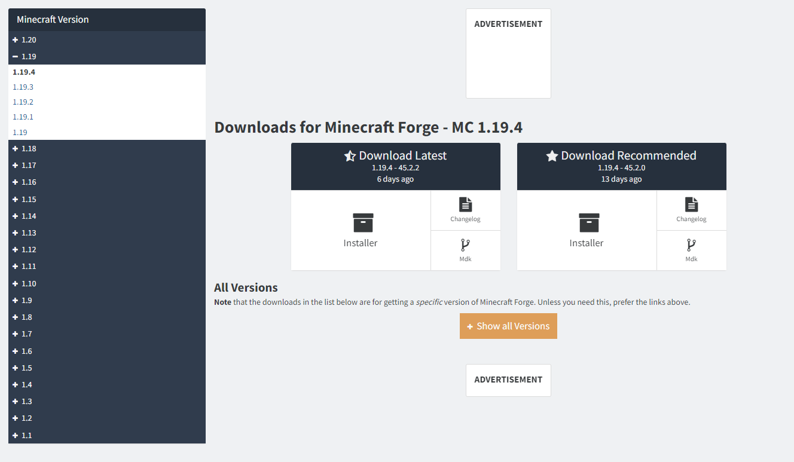
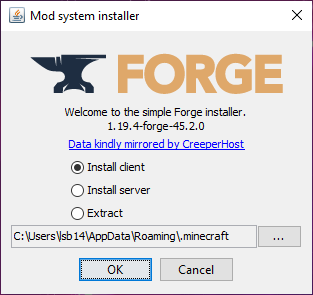
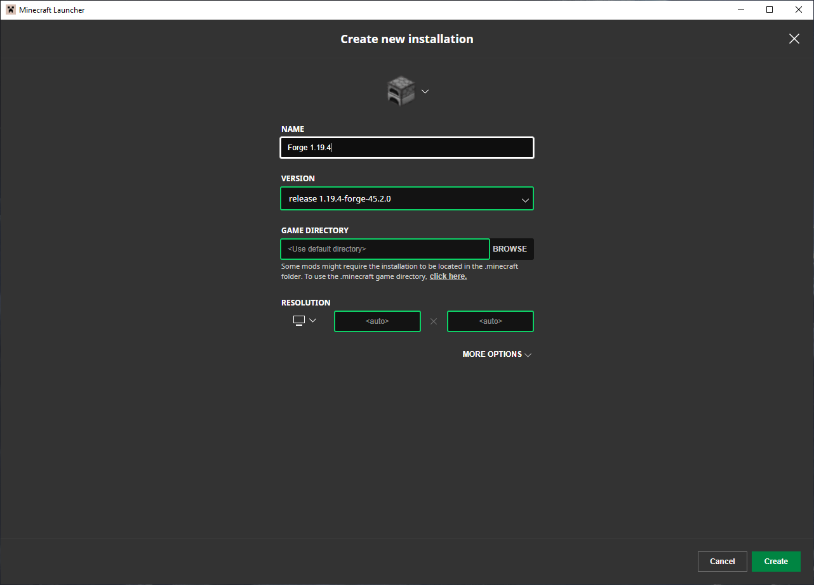
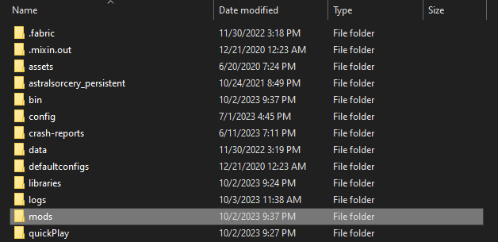
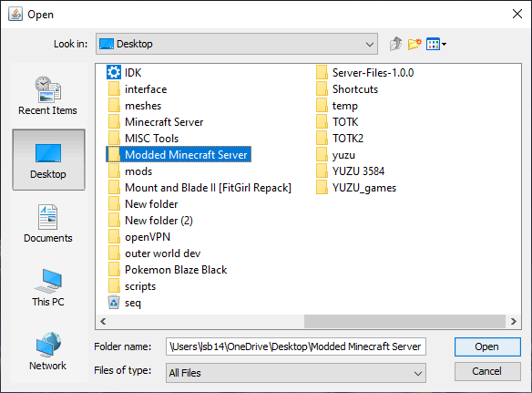
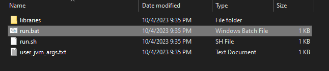
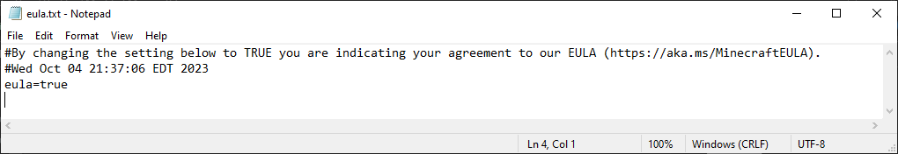
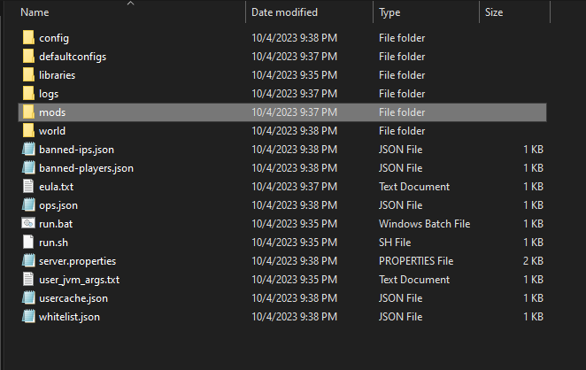
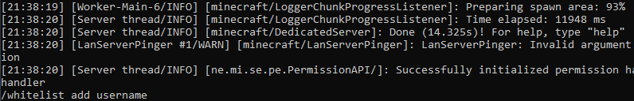
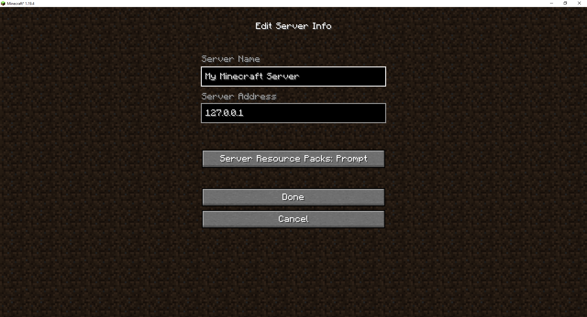

```{r setup, include=FALSE}
knitr::opts_chunk$set(echo = FALSE)
```

```{r}
library(htmltools)

```

```{css}
body {
  font-family: Helvetica, Arial, sans-serif;
  background-color: #3e3e3e;
}

#header {
  background-color: #858585;
  color: white;
  padding: 20px;
  text-align: center;
}

#forgeinstall, #modinstall, #serversetup, #faq {
  padding: 40px;
  background-color: #f4f4f4;
}

#section2 {
  background-color: #E9ECEF;
}

.section-title {
  font-size: 24px;
  margin-bottom: 10px;
}

/* Style the tab */
.tab {
  overflow: hidden;
  border: 1px solid #ccc;
  background-color: #f1f1f1;
}

/* Style the buttons that are used to open the tab content */
.tab button {
  background-color: inherit;
  float: left;
  border: none;
  outline: none;
  cursor: pointer;
  padding: 14px 16px;
  transition: 0.3s;
}

/* Change background color of buttons on hover */
.tab button:hover {
  background-color: #ddd;
}

/* Create an active/current tablink class */
.tab button.active {
  background-color: #ccc;
}

/* Style the tab content */
.tabcontent {
  text-align: center;
  display: none;
  padding: 6px 12px;
  border: 1px solid #ccc;
  border-top: none;
  animation: fadeEffect 1s; /* Fading effect takes 1 second */
}

/* Go from zero to full opacity */
@keyframes fadeEffect {
  from {opacity: 0;}
  to {opacity: 1;}
}
```
<!-- Tab links -->
<div class="tab">
  <button class="tablinks" onclick="openCity(event, 'forgeinstall')">Installing Forge</button>
  <button class="tablinks" onclick="openCity(event, 'modinstall')">Installing Mods</button>
  <button class="tablinks" onclick="openCity(event, 'serversetup')">Setting up the Server</button>
  <button class="tablinks" onclick="openCity(event, 'faq')">FAQ</button>
</div>

<!-- Tab content -->

<div id="header">
  <h1>Setting Up</h1>
  <p>Before following this guide, be sure that you’ve installed Minecraft Java edition on your computer. Also, make sure that you’ve launched the game at least once with the version you’d like to install mods for. We’ll be using Minecraft version 1.19.4, but the process should be the same for all versions.
  </p>
</div>

<script>
  function openCity(evt, cityName) {
  // Declare all variables
  var i, tabcontent, tablinks;

  // Get all elements with class="tabcontent" and hide them
  tabcontent = document.getElementsByClassName("tabcontent");
  for (i = 0; i < tabcontent.length; i++) {
    tabcontent[i].style.display = "none";
  }

  // Get all elements with class="tablinks" and remove the class "active"
  tablinks = document.getElementsByClassName("tablinks");
  for (i = 0; i < tablinks.length; i++) {
    tablinks[i].className = tablinks[i].className.replace(" active", "");
  }

  // Show the current tab, and add an "active" class to the button that opened the tab
  document.getElementById(cityName).style.display = "block";
  evt.currentTarget.className += " active";
}
</script>


 <div id="forgeinstall" class = "tabcontent"> 
 <h2 class="section-title">Installing Forge</h2>
  <ul>
    <li>
      <p><strong>Step 1:</strong> Navigate to the download page for
        [Minecraft Forge](https://files.minecraftforge.net/net/minecraftforge/forge/index_1.20.2.html) </p>
       
    </li>
    <li>
      <p><strong>Step 2:</strong> Use the menu on the left side of the page to 
      select your preferred version of Minecraft.</p>
    </li>
    <li>
      <p><strong>Step 3:</strong> Click the button labeled “Installer.”</p>
      <p><strong> Note:</strong> If there are two download options, select the one on the right labeled “Download Recommended.”</p>
    </li>
    <li>
      <p><strong>Step 4:</strong> Use the menu on the left side of the page to 
      select your preferred version of Minecraft.</p>
    </li>
    <li>
      <p><strong>Step 5:</strong> On your keyboard, press the Windows key and the “R” key 
      at the same time.</p>
    </li>
      </li>
      <li>
      <p><strong>Step 6:</strong> Enter “Downloads” into the search box.</p>
    </li>
    <li>
      <p><strong>Step 7:</strong> In the new window, double click on the file you 
      just downloaded, which should have a name ending in “installer.jar” and be
      near the top of the download list.</p>
      <p><strong>Note:</strong> If you are prompted to choose how to run the file,
      check our troubleshooting section to install the Java Development Kit that allows you
      to run .jar files</p>
    </li>
    <li>
      <p><strong>Step 8:</strong> "Install Client" should already be selected, so simply
      click the "OK" button. </p>
      
    </li>
    <li>
      <p><strong>Step 9:</strong> Once the window stating that the installation was successful, click the "OK" button.</p>
    </li>
    <li>
      <p><strong>Step 10:</strong> Navigate to the Minecraft launcher, but do not launch the game yet.</p>
    </li>
    <li>
      <p><strong>Step 11:</strong> Click the "Installations" button near the top of the launcher. </p>
    </li>
     <li>
      <p><strong>Step 12:</strong> Click "New installation" just below the search bar. </p>
      
    </li>
     <li>
      <p><strong>Step 13:</strong> Name the installation whatever you'd like. </p>
    </li>
    <li>
      <p><strong>Step 14:</strong> Select your newly installed Forge version in the "Version"
      dropdown menu.</p>
    </li>
    <li>
      <p><strong>Step 15:</strong> Click "Create" in the bottom right of the launcher. </p>
    </li>
    <li>
      <p><strong>Step 16:</strong> Return to the main page by clicking "Play" near the top of the launcher </p>
    </li>
    <li>
      <p><strong>Step 17:</strong> Select your newly created installation in the dropdown menu to the left of the large green "Play Button". </p>
    </li>
    <li>
      <p><strong>Step 18:</strong> A warning about modding should appear, you may read it if you'd like. </p>
    </li>
    <li>
      <p><strong>Step 19:</strong> Continue by clicking the green "Play" button </p>
    </li>
  </ul>
</div>


<div id="modinstall" class = "tabcontent">
  <h2 class="section-title">Installing Mods</h2>
  <p>Selecting mods to install can be more of an art than a science, since mods are community made and may not always work with all other mods. Mods can be found from various sources, such as [MinecraftMods.com](https://www.minecraftmods.com/) and [CurseForge.com](https://www.curseforge.com/MINECRAFT). When selecting mods, it’s important to ensure they are for your version of Minecraft Forge, as otherwise they can cause major issues. Luckily, the mod installation steps are now quite simple. </p>
  <br>
  <ol>
    <li>
      <p><strong>Step 1:</strong> Navigate to your desktop.</p>
    </li>
    <li>
      <p><strong>Step 2:</strong> On your keyboard, press the <strong>Windows</strong> key and the <strong>R</strong> key at the same time.</p>
    </li>
    <li>
      <p><strong>Step 3:</strong> Enter *%appdata%* into the search box</p>
    </li>
    <li>
      <p><strong>Step 4:</strong> Open the "*.minecraft*" folder</p>
    </li>
    <li>
      <p><strong>Step 5:</strong> Open the "mods" folder</p>
      
    </li>
    <li>
      <p><strong>Step 6:</strong> You can now copy and paste the mods you'd like to use into this folder.</p>
    </li>
    <li>
      <p><strong>Step 7:</strong> Launch the game using your Forge Installation to get started playing!</p>
    </li>
  </ol>
</div>

<div id="serversetup" class = "tabcontent">
  <h2 class="section-title">Setting Up a Server</h2>
   <ol>
    <li>
      <p><strong>Step 1:</strong> Navigate to your desktop.</p>
    </li>
     <li>
      <p><strong>Step 2:</strong> On your keyboard, press "ctrl", "shift", and "n" at the same time to create a new folder.</p>
    </li>
    <li>
      <p><strong>Step 3:</strong> Name the folder whatever you'd like, it will be the folder that holds your server.</p>
    </li>
    <li>
      <p><strong>Step 4:</strong> Navigate to the Minecraft Forge installer for your chosen Minecraft version (alternatively follow steps 1-7 of the <a href="#forgeinstall">Installing Forge</a> guide.) </p>
    </li>
    <li>
      <p><strong>Step 5:</strong> Select "Install Server" in the installer. </p>
    </li>
    <li>
     <p><strong>Step 6:</strong> Click the button labeled "..." to the right of the file path. </p>
    </li>
    <li>
     <p><strong>Step 7:</strong> Click the "Desktop" button on the right side of the window.</p>
     
    </li>
    <li>
     <p><strong>Step 8:</strong> In the window, open the folder that you'd like to contain your server.</p>
    </li>
    <li>
     <p><strong>Step 9:</strong> Click the "Open" near the bottom right of the window.</p>
    </li>
    <li>
     <p><strong>Step 10:</strong> Click the "OK" button.</p>
    </li>
    <li>
      <p><strong>Step 11:</strong> Navigate to your server folder. </p>
    </li>
    <li>
     <p><strong>Step 12:</strong> Open the file "run.bat" and wait for the text to stop scrolling.</p>
      
    </li>
    <li>
      <p><strong>Step 13:</strong> Press "enter" on the keyboard to close the terminal window </p>
    </li>
    <li>
      <p><strong>Step 14:</strong> In the server folder, open "eula.txt" and read the provided link if you'd like. </p>
    </li>
     <li>
     <p><strong>Step 15:</strong> Replace "eula=false" with *"eula=true"*.</p>
      
    </li>
    <li>
      <p><strong>Step 16:</strong> On the keyboard, press "ctrl" and "s" at the same time to save the file. </p>
    </li>
    <li>
      <p><strong>Step 17:</strong> Close the window. </p>
    </li>
    <li>
     <p><strong>Step 18:</strong> Place your chosen mods into the "mods" folder.</p>
     <p><strong>Note:</strong> Assuming that you've already installed them for single player, simply copy and paste your single player mods into your server's folder.</p>
      
    </li>
    <li>
      <p><strong>Step 19:</strong> Replace "server.properties" with one of the provided replacements, depending on your preferred settings. </p>
    </li>
    <li>
      <p><strong>Step 20:</strong> Open "run.bat" and wait for the server to start. </p>
    </li>
    <li>
     <p><strong>Step 21:</strong> Type "/op" followed by your Minecraft username into the terminal.</p>
      <p><strong>Ex:</strong> "/op LumberHat"</p>
    </li>
     <li>
     <p><strong>Step 22:</strong> Press the "enter" key to grant operator privileges on the server.</p>
    </li>
    <li>
     <p><strong>Step 23:</strong> Type "/whitelist add " followed by your Minecraft username into the terminal.</p>
     <p><strong>Ex:</strong> "/whitelist add LumberHat"</p>
      
    </li>
    <li>
      <p><strong>Step 24:</strong> Press the "enter" key to grant permission to join the server. </p>
    </li>
    <li>
      <p><strong>Step 25:</strong> Repeat steps <strong>21-24</strong> with the usernames of friends you'd like to add to the server. </p>
    </li>
  </ol>
  
  <h3>The server should now be running locally, now it’s time to connect! </h3>
  
  <ol>
    <li>
      <p><strong>Step 1:</strong> Launch Minecraft using your Forge Installation.</p>
    </li>
     <li>
       <p><strong>Step 2:</strong> From the main menu, click the "Multiplayer" button.</p>
    </li>
     <li>
     <p><strong>Step 3:</strong> Next click "Add Server" near the bottom of the screen.</p>
    </li>
    <li>
     <p><strong>Step 4:</strong> Name the server whatever you'd like.</p>
      
    </li>
    <li>
     <p><strong>Step 5:</strong> Enter *"127.0.0.1"* into the address field.</p>
    </li>
    <li>
       <p><strong>Step 6:</strong> Click the "Done" button. </p>
    </li>
    <li>
       <p><strong>Step 7:</strong> Select your new server profile.</p>
    </li>
    <li>
       <p><strong>Step 8:</strong> Click "Join Server" near the bottom of the screen.</p>
    </li>
  </ol>
  
  <h3>Connecting friends is similar, but there are a few things to note.</h3>
  <ol>
    <li>
       <p><strong>Step 1:</strong> Ensure your friends are on the same network as you are. </p>
       <p><strong>Note:</strong> With port forwarding you can connect across networks, but that adds security risks so we won't cover it here.</p>
    </li>
    <li>
       <p><strong>Step 2:</strong> Make sure they've installed the same mods as the ones on the server. </p>
    </li>
    <li>
       <p><strong>Step 3:</strong> Make sure they're using the same version of Minecraft Forge. </p>
    </li>
    <li>
       <p><strong>Step 4:</strong> They'll need to be whitelisted before they can join. </p>
    </li>
    <li>
       <p><strong>Step 5:</strong> They'll need your public IPv4, which can be found near the top of the screen at [whatismyip.com](https://www.whatismyip.com/) </p>
    </li>
  </ol>
  <h3>Once you've checked these things, they're ready to connect! Just have them follow these instructions. </h3>
  <ol>
    <li>
       <p><strong>Step 1:</strong> Launch Minecraft using your Forge Installation. </p>
    </li>
    <li>
       <p><strong>Step 2:</strong> From the main menu, click the "Multiplayer" button. </p>
    </li>
    <li>
       <p><strong>Step 3:</strong> Next click, "Add Server" near the bottom of the screen. </p>
    </li>
    <li>
       <p><strong>Step 4:</strong> Enter the host's public IPv4, followed by *":25565"* into the address field. </p>
    </li>
    <li>
       <p><strong>Step 5:</strong> Click the "Done" button. </p>
    </li>
    <li>
       <p><strong>Step 6:</strong> Select your new server profile. </p>
    </li>
    <li>
       <p><strong>Step 7:</strong> Click "Join Server" near the bottom of the screen. </p>
    </li>
  </ol>
  <h3> Closing the server is very simple.</h3>
   <ol>
    <li>
       <p><strong>Step 1:</strong> Return to the server terminal. </p>
    </li>
    <li>
       <p><strong>Step 2:</strong> Type "stop into the terminal. </p>
    </li>
    <li>
       <p><strong>Step 3:</strong> Press the "enter" key. </p>
    </li>
  </ol>
</div>

<div id="faq" class = "tabcontent">
  <h2 class="section-title">FAQ</h2>
  <ol>
    <li>
       <p><strong>*Question:*</strong> *My friends could join when I first told them how, why can't they now?* </p>
      <p><strong>Answer:</strong> Public IP addresses can change, so return to [whatismyip.com](https://www.whatismyip.com/) and make sure it's the same as what they're entering.</p>
    </li>
    <li>
       <p><strong>*Question:*</strong> *Why can't I open the Minecraft Forge installer on my computer?* </p>
      <p><strong>Answer:</strong> Since the installer is a ".jar" file, you should make sure you have java installed, you can download it at [this site](https://www.java.com/download/ie_manual.jsp).</p>
    </li>
    <li>
       <p><strong>*Question:*</strong> *Can my friends connect from other networks?* </p>
      <p><strong>Answer:</strong> No. At least not without port forwarding, which is a process that varies depending on internet providers and can cause security risks.</p>
    </li>
</div>
```